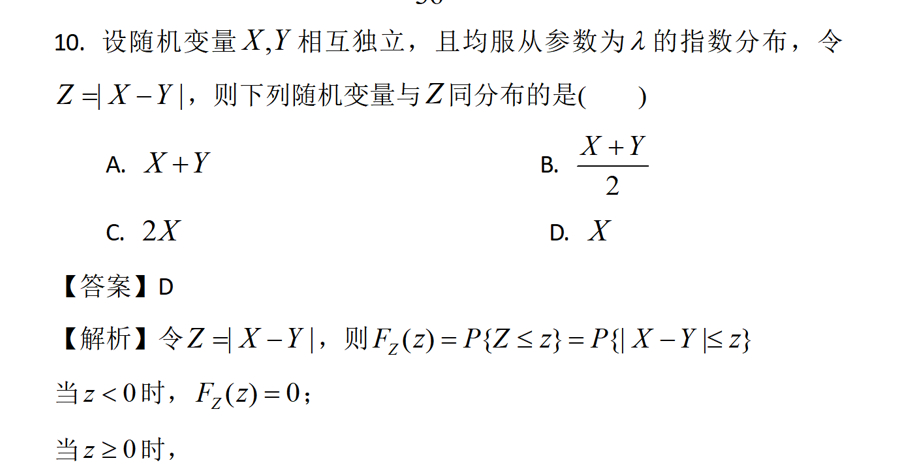
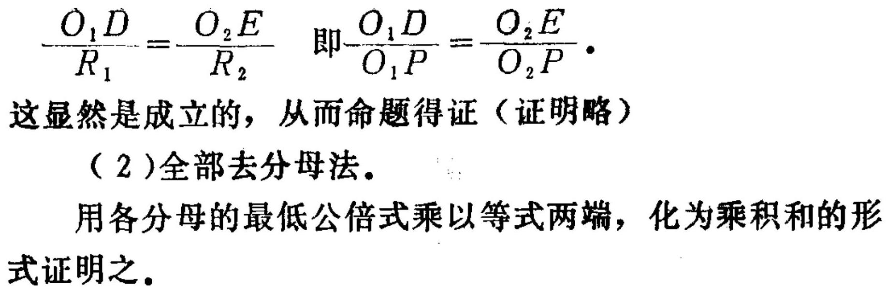
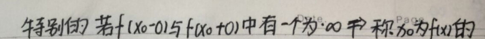
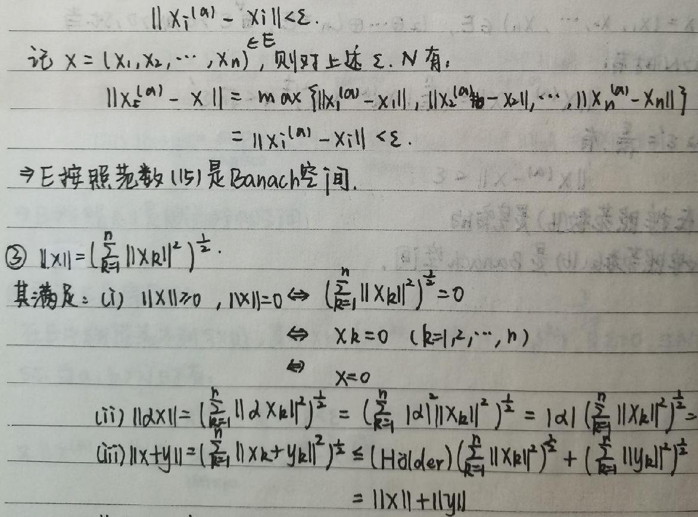

# 简介

<p style="text-indent: 2em;">这是一个包含图片和对应Latex文本标签的数据集仓库，既有电子文档的图像，也有手写图像，该仓库的数据集全都是真实的数据集。图像中的文本内容复杂多样，适用于训练和测试数学公式识别模型。</p>

<p align="center">下载地址(huggingface): <a href="https://huggingface.co/datasets/wzmmmm/Image2Latex/tree/main">https://huggingface.co/datasets/wzmmmm/Image2Latex/tree/main</a></p>

<p align="center">下载地址(kaggle): <a href="https://www.kaggle.com/datasets/weizhiming/images2latex-dataset">https://www.kaggle.com/datasets/weizhiming/images2latex-dataset</a></p>

**目录结构:** 
```
Chinese_small_dataset0/
├── images/                   # 存放图像的文件夹
│   ├── image1.png
│   ├── image2.png
│   └── ...
├── labels/                   # 存放对应 LaTeX 标签的文件夹
│   ├── label1.txt
│   ├── label2.txt
│   └── ...
├── metadata.csv              # 数据集的元数据（如图片和标签的配对关系）
Chinese_small_dataset1/...
```

# 数据

<p align="center"><strong>Chinese_small_dataset系列:</strong></p>

这个系列的数据集主要是电子文档图片-Latex文本。示例:
**图片：**

**标签:** 
```latex
10. 设随机变量$X,Y$相互独立，且均服从参数为$\lambda$的指数分布，令$Z = |X - Y|$，则下列随机变量与$Z$同分布的是( )
A. $X + Y$ B. $\frac{X + Y}{2}$
C. $2X$ D. $X$
【答案】D
【解析】令$Z = |X - Y|$，则$F_Z(z)=P\{Z\leq z\}=P\{|X - Y|\leq z\}$
当$z < 0$时，$F_Z(z)=0$；
当$z\geq0$时，
```

---
**图片：**


**标签:** 
```latex
\frac{O_{1}D}{R_{1}}=\frac{O_{2}E}{R_{2}} \quad 即\frac{O_{1}D}{O_{1}P}=\frac{O_{2}E}{O_{2}P}.

这显然是成立的, 从而命题得证 (证明略)

(2)全部去分母法.

用各分母的最低公倍式乘以等式两端, 化为乘积和的形式证明之.
```

---

<p align="center"><strong>handwriteen_dataset系列:</strong></p>

这个系列的数据集主要是手写图片-Latex文本标签。示例:

**图片：**


**标签:** 
```latex
特别的，若\(f(x_0 - 0)\)与\(f(x_0 + 0)\)中有一个为\(\infty\)\(\rightarrow\)称\(x_0\)为\(f(x)\)的
```

---
**图片：**


**标签:** 
```latex
记$X=(X_1,X_2,\cdots,X_n)\in E$, 则对上述$\varepsilon>0,\ N$有,
\[
\begin{align*}
\left\|X_{\varepsilon}^{(n)}-X\right\|&=\max\left\{\left\|X_1^{(n)}-X_1\right\|,\left\|X_2^{(n)}-X_2\right\|,\cdots,\left\|X_n^{(n)}-X_n\right\|\right\}\\
&=\left\|X_i^{(n)}-X_i\right\|<\varepsilon.
\end{align*}
\]
$\Rightarrow E$按照范数(15)是Banach空间.

$\textcircled{3}\|X\| = (\sum_{k = 1}^{n}\|X_k\|^2)^{\frac{1}{2}}$.
其满足：(i) $\|X\|\geq0$, $\|X\| = 0\Leftrightarrow(\sum_{k = 1}^{n}\|X_k\|^2)^{\frac{1}{2}}=0$
\[
\begin{align*}
&\Leftrightarrow X_k = 0\ (k = 1,2,\cdots,n)\\
&\Leftrightarrow X = 0
\end{align*}
\]
(ii) $\|\alpha X\|=(\sum_{k = 1}^{n}\|\alpha X_k\|^2)^{\frac{1}{2}}=(\sum_{k = 1}^{n}|\alpha|^2\|X_k\|^2)^{\frac{1}{2}}=|\alpha|(\sum_{k = 1}^{n}\|X_k\|^2)^{\frac{1}{2}}$
(iii) $\|X + Y\|=(\sum_{k = 1}^{n}\|X_k+Y_k\|^2)^{\frac{1}{2}}\leq(\text{Hölder})(\sum_{k = 1}^{n}\|X_k\|^2)^{\frac{1}{2}}+(\sum_{k = 1}^{n}\|Y_k\|^2)^{\frac{1}{2}}=\|X\|+\|Y\|$
```
